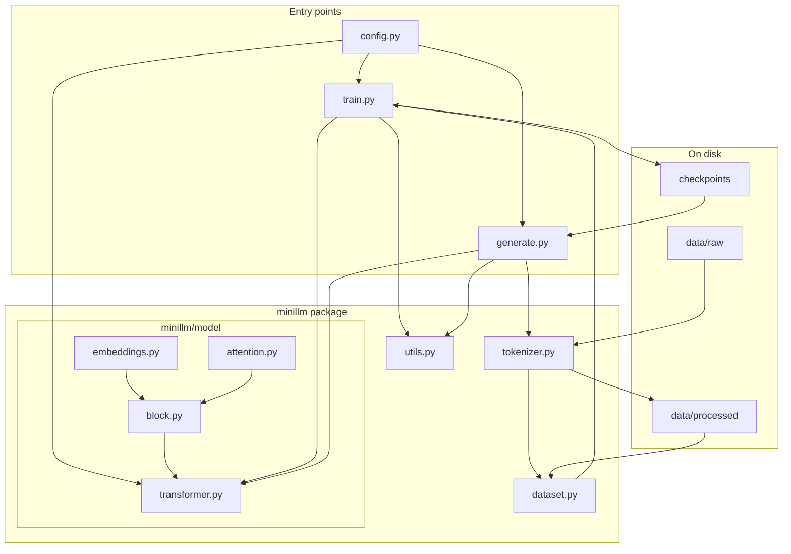
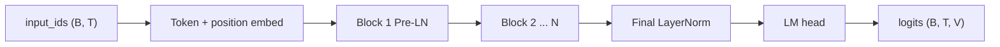
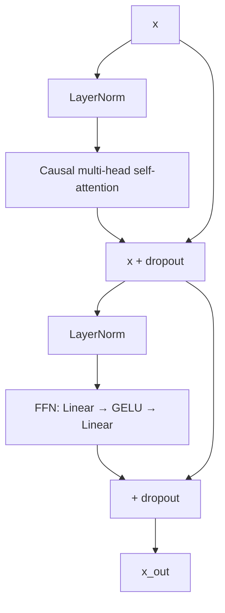
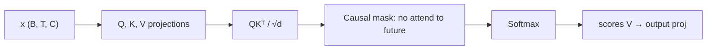
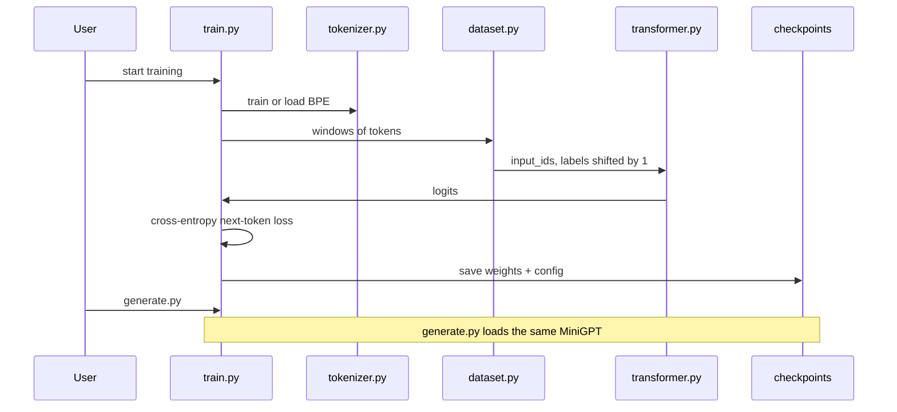
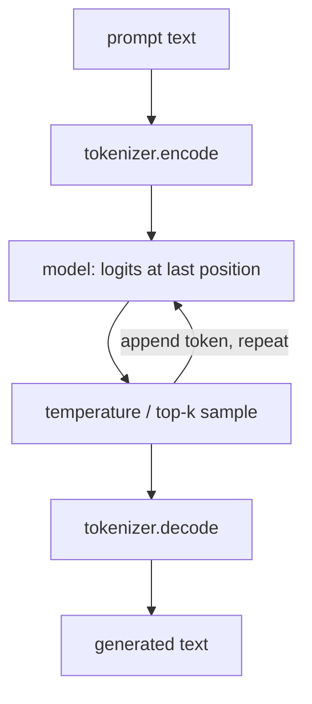

# Mini LLM model

Decoder-only transformer: files, modules, and data flow for next-token prediction.

## How the pieces fit

## Neural net: decoder stack

Each block:

Causal attention (next-token / “next word” constraint):

## Training vs generation

## Module responsibilities

| File | Role |
| --- | --- |
| `config.py` | `d_model`, heads, layers, vocab, seq len, paths, optimizer |
| `minillm/tokenizer.py` | BPE train/load, `encode`, `decode`, special tokens |
| `minillm/dataset.py` | Raw text → packed `(input_ids, labels)` batches |
| `minillm/model/embeddings.py` | Token + positional embeddings |
| `minillm/model/attention.py` | Causal multi-head self-attention |
| `minillm/model/block.py` | Pre-LN attention + FFN residual block |
| `minillm/model/transformer.py` | Full decoder + LM head; `forward` → logits |
| `minillm/utils.py` | Device, seed, save/load checkpoint |
| `train.py` | Loop: batch → loss → backward → checkpoint |
| `generate.py` | Autoregressive sampling from a prompt |

`transformer.py` is the only nn.Module the entrypoints construct. Attention and embeddings are implementation details of that stack.
